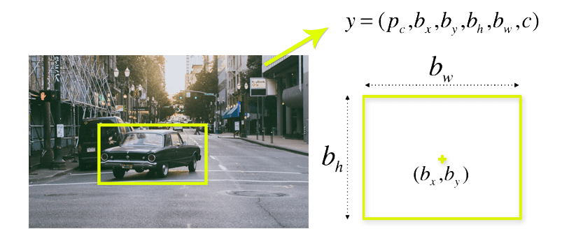

# Battery Cell Dent Detection

https://user-images.githubusercontent.com/96538649/229579337-b31416a8-79ed-4c0d-acbe-f258db50ec62.mp4

## Introduction

### Motive:

Battery cells are integral components of many electronic devices and play a crucial role in powering them. However, damaged or dented battery cells can be hazardous, leading to possible leaks and damages to the surrounding electronic components. To address this issue, a solution involving object detection through machine learning was developed using the YOLO-V8 architecture. We aim to reduce the number of dented cells that go into the market through deployment of a robust algorithm leading to detection and elimination of such faulty devices.

### Process in brief:

To begin with, 40 slow-motion videos of dented batteries were uploaded to Roboflow, a platform that allows the extraction of individual image frames from videos and provides preprocessing techniques such as Auto-Orient and Resize. In total, 4000 images were extracted, with 5 frames per second. The images were annotated to divide the dented batteries into different classes, and null annotations were added to images with no dents. The dataset was then split into a train, validation, and test set in an 80:10:10 ratio. More details on this will be taken up in 'Data'

The YOLO-V8 algorithm uses a residual block to divide the image into various grids, where each grid detects objects that appear within them. A single bounding box regression is used to predict the height, width, center, and class of objects, with IOU (Intersection Over Union) used to eliminate false positives.

The battery cell dent detection model can be deployed using Arduino and RaspberryPi to detect damaged cells. This technology can be applied in various industries, such as electric car manufacturing, where it can be used to filter out unhealthy cells and prevent safety issues such as thermal runaway. This technology can also be utilized to ensure the safety and reliability of batteries used in aircraft.

### End Use:

To use YOLOv8 in a production factory for quality control, a camera system should be set up at the appropriate location on the production line to capture images of cells as they move along. These images can then be fed into the algorithm for analysis. The YOLOv8 algorithm will analyze each image, identify cells with dents, and alert the factory's quality control team if any cells with dents are detected. The quality control team can then take appropriate action to ensure that only cells without dents are sent out for further processing.

The deployment of YOLOv8 for cell dent detection in a production factory has several benefits.

- Increase the accuracy and efficiency of the quality control process, as the algorithm can analyze images much faster and more accurately than a human can.
- Save time and money for the factory by reducing the need for manual inspections.
- Ensure that only high-quality cells are sent out for further processing, which can ultimately improve the quality of the final product.

In conclusion, the YOLO-V8 object detection algorithm, coupled with the Roboflow platform, has demonstrated significant potential in detecting damaged battery cells. This technology can contribute significantly to ensuring the safety and reliability of electronic devices, as well as in industrial applications where battery cells play a crucial role.

## Data

With the help of Roboflow we uploaded our video datasets, augmented and preprocessed our data. The platform also supports integration with popular deep learning frameworks like TensorFlow, PyTorch, and Keras, as well as export to common formats like ONNX and TensorFlow Lite for deployment on various platforms.
Roboflow uses a process called video frame extraction to convert a video file into a set of individual image files. This process involves taking each frame of the video and saving it as a separate image file. The frames are then saved as individual image files, with a filename that includes the frame number and file extension (e.g., frame_001.jpg, frame_002.jpg, etc.).

Ultralytics uses the Albumentations library to augment the training data used to train the YOLOv5 object detection model. Albumentations is a Python library for image augmentation that provides a wide range of techniques to improve the quality and quantity of the training data. It supports a variety of image formats and can be easily integrated into the training pipeline of deep learning frameworks like PyTorch, TensorFlow, and MXNet.
Ultralytics provides an implementation of YOLOv8 that includes Albumentations in its training pipeline. The user can configure the augmentation parameters by modifying a YAML configuration file that specifies the augmentation techniques and their hyperparameters. The augmented images are then fed into the YOLOv8 model for training using PyTorch.

- Uploaded 40 slow-motion videos of dented batteries to Roboflow to collect data from different angles.
- Used Roboflow to extract individual image frames from the videos and preprocess the data.
- Saved 5 frames per second, resulting in 4000 images.
- Applied Auto-Orient and Resize techniques to preprocess the images (640x640).
- Annotated dent images to divide them into different classes and marked others as null.
- Split the dataset into train, validation, and test sets in an 80:10:10 ratio.
- Generated augmented versions of each image in the training set to create new training examples for the model to learn from.
- Augmentation techniques applied include Horizontal and Vertical Flips, Rotation between -15° and +15°, and Exposure adjustment of the bounding box between -20% and +20%.

Annotation examples:

<p align="center">
  
  
</p>

## Model

As a solution to our object detection problem, we chose the yolo-v8 architecture. The v8 architecture was made public and is maintained by [Ultralytics](https://ultralytics.com/).

YOLO or you only look once, is a real-time object detection algorithm. It was introduced in 2016 in the research paper [You Only Look Once: Unified, Real-Time Object Detection](https://arxiv.org/pdf/1506.02640v5.pdf). Compared to other regional proposal classification networks (Fast RCNN and Faster RCNN), which perform detection on various region proposals and thus end up performing prediction multiple times for various regions in a image, YOLO architecture is more like a FCNN (fully convolutional neural network) and passes the image ($n * n$) once through the FCNN and the output is ($m * m$) prediction.

Why YOLO is preferred over other object detection alogrithm:

- **Speed**: This algorithm improves the speed of detection because it can predict objecst in real-time
- **High Accuracy**: YOLO is a predictive technique that provides accurate results with minimal background errors.
- **Learning capabilities**: The algorithm has excellent learning capabilities that enable it to learn the representations of objects and apply them in object detection.

### How YOLO works

The YOLO algorithm works using the following three techiques:

- **Residual block**: First, the image is divided into various grids. Each grid has a dimension of $s*s$.
  

  In the above image, there are many grid cells of equal dimension. Every grid cell will detect objects that appear within them. For example, if an object center appears within a grid cell, then this cell will be responsible for detecting it.

- **Bounding box regression**: A bounding box is an outline that highlights an object in an image. Every bounding box in the image consists of the following attributes:
  - Width (bw)
  - Height (bh)
  - Class (for example: person, car, traffic light)
  - Boudning box center (bx, by)
    
    YOLO uses a single bounding box regression to predict the height, width, center and class of objects.
- **IOU** or Intersection Over Union: This is a phenomenon in object detection that describes how boxes overlap. YOLO uses IOU to provide an output box that surrounds the objects perfectly.
  Each grid cell is responsible for predicting the bounding boxes and confidence scores. The IOU is equal to 1 if the predicted bounding box is the same as the real box. This mechanism eliminates bounding boxes that are not equal to the real box.

## Usage

**Inference using pretrained model**

```python
import cv2
from ultralytics import YOLO
import numpy as np

cap = cv2.VideoCapture("YOUR_VIDEO_HERE")

model = YOLO("weights/cell_detection_YOLO.pt")
pTime=0

while(True):
	ret,frame=cap.read()
	results = model(frame,device='cpu')
	result=results[0]


	bboxes = np.array(result.boxes.xyxy.cpu(),dtype='int')
	classes=np.array(result.boxes.cls.cpu(),dtype='int')

	for clss,bbox in zip(classes,bboxes):
		x,y,x2,y2 = bbox
		cv2.rectangle(frame,(x,y),(x2,y2),(0,0,255),2)
	
	start_time = time.time()
    	elapsed_time = start_time - pTime
    	fps = 1 / elapsed_time
    	pTime = start_time


	cv2.imshow("Vid",frame)

	key=cv2.waitKey(1)

	if key==27:
		break

cap.release()
cv2.destroyAllWindows()
```

**Using python scripts:**

```console
# Train the model
python src/train.py --model=yolov8n.pt --data=data.yaml --epochs=300 export=onnx

# Predict on model
python src/predict.py --model=yolov8n.pt --image_path=cell_dent.png
```

## References

- Roboflow - [https://roboflow.com/models/object-detection](https://roboflow.com/model/yolov8)
- Ultralytics documentation - https://docs.ultralytics.com/
- YOLO - https://arxiv.org/pdf/1506.02640.pdf
- YOLO Object Detection using OpenCV and Python - https://towardsdatascience.com/yolo-object-detection-with-opencv-and-python-21e50ac599e9
- ONNX - https://towardsdatascience.com/onnx-the-standard-for-interoperable-deep-learning-models-a47dfbdf9a09
- Tensorflow Lite - https://www.tensorflow.org/lite/examples/object_detection/overview

### [Presentation](https://www.canva.com/design/DAFfEYCg88o/at0mVxrTTsd3CVBiGAQM7w/view?utm_content=DAFfEYCg88o&utm_campaign=designshare&utm_medium=link2&utm_source=sharebutton)

